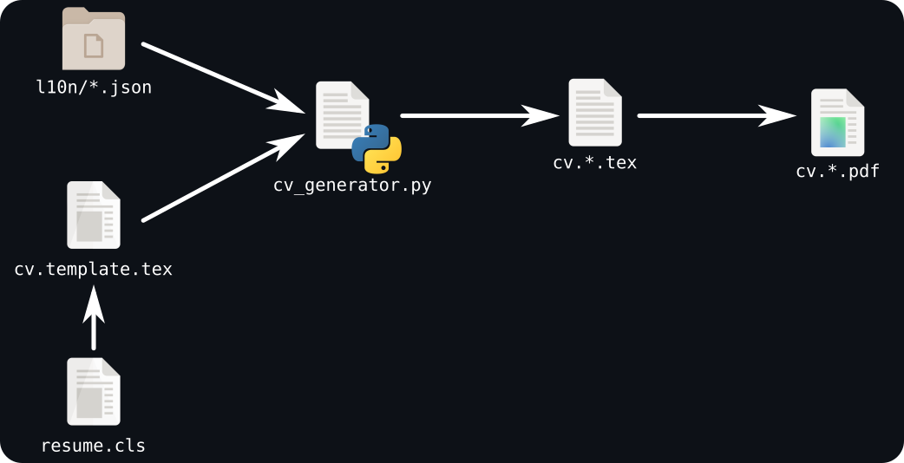

# CV

This projects uses Python and LaTeX to generate and build my resumes in English, French and Spanish.

## ⚙ Generation Process

The resumes are PDF files, one for each languages, that are generated from LaTeX files. The final PDF files are called `cv.<language>.pdf` (like `cv.en.pdf`), and their respective LaTeX files are called `cv.<language>.tex`. Those files are generated using the Python script `cv_generator.py` that interprets the commands in `cv.template.tex`. All strings used in the resumes are taken from the translation files under `l10n/`.

Each JSON files in this directory will generate an associated `tex` and `pdf` files. If you want to add a new resume in another language, you just need to add a new JSON file.



## 🛠 Build

The following steps will get you a copy of the project and the PDF files (in all languages).

First, clone the project using:

```bash
git clone https://github.com/Cynnexis/CV.git
cd CV
```

Then, use the `Makefile` to build the PDF. Note that this step requires **Docker**.

```bash
make docker-build
make cv
```

After Docker has downloaded all necessary images, and `lualatex` has been executed, you will find all `cv.<language>.pdf` files at the root of the project.

To remove only the PDF, execute `make clean-pdf`.

To remove the generated images, execute `make clean-png` (reciprocally `make png` to generate the images).

To remove only the LaTeX built files, use `make clean-build`.

Finally, to remove every generated files, use `make clean`.

## 🤝 Acknowledgements

### Google Material Design Icons

Icons in the resumes are from the [Google Material Design Icons project](https://github.com/google/material-design-icons) licensed under [Apache License 2.0](https://github.com/google/material-design-icons/blob/master/LICENSE).

### GNOME Adwaita Icons

The file [`images/build_process.png`](images/build_process.png) uses icons from the [GNOME Adwaita Icons project](https://gitlab.gnome.org/GNOME/adwaita-icon-theme/-/blob/master/COPYING) licensed under [GNU LGPL v3 or](https://gitlab.gnome.org/GNOME/adwaita-icon-theme/-/blob/master/COPYING).

## 📝 License

The project is under the [GNU Affero General Public License](LICENSE).
